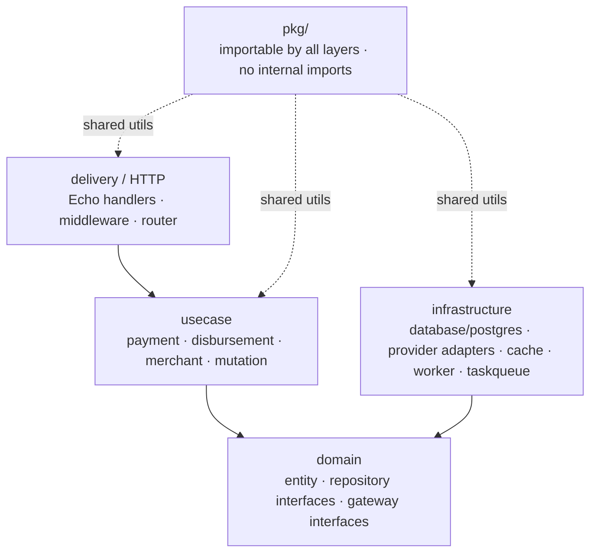
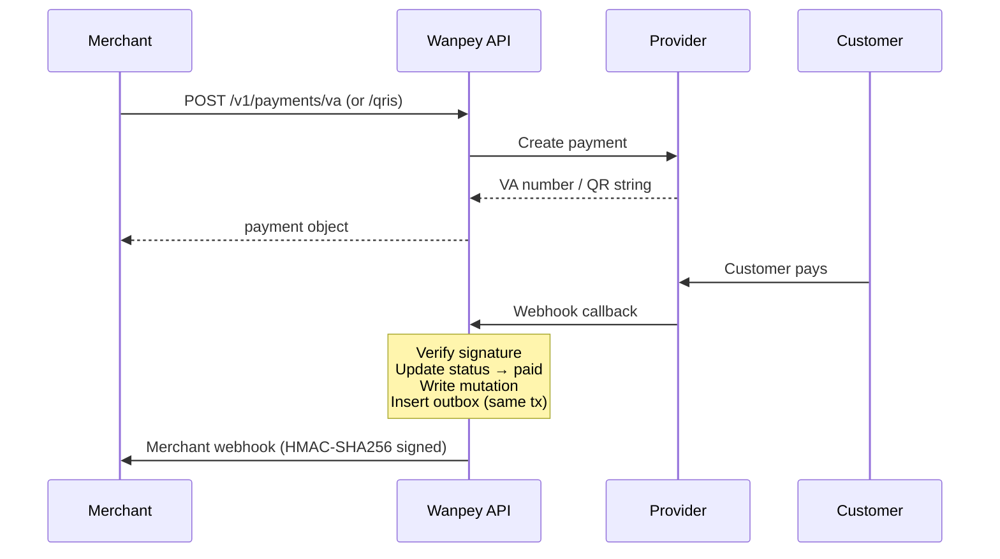
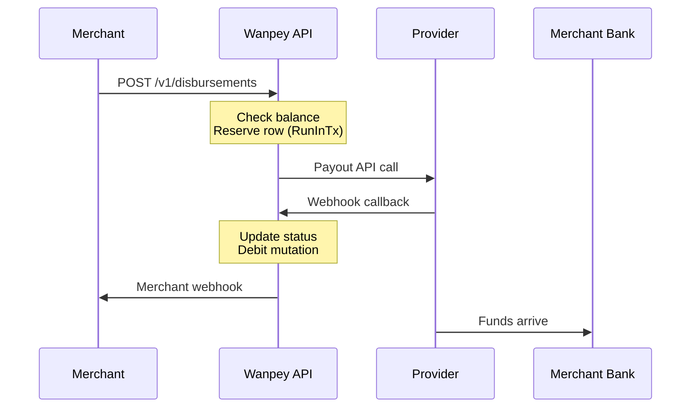
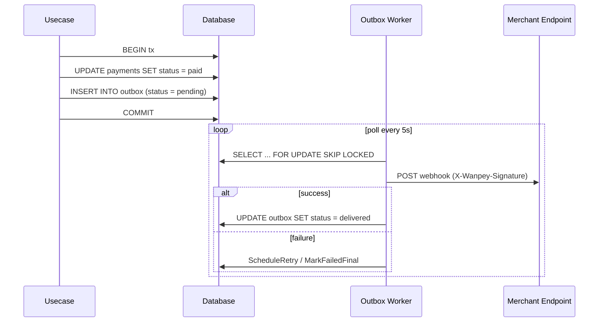
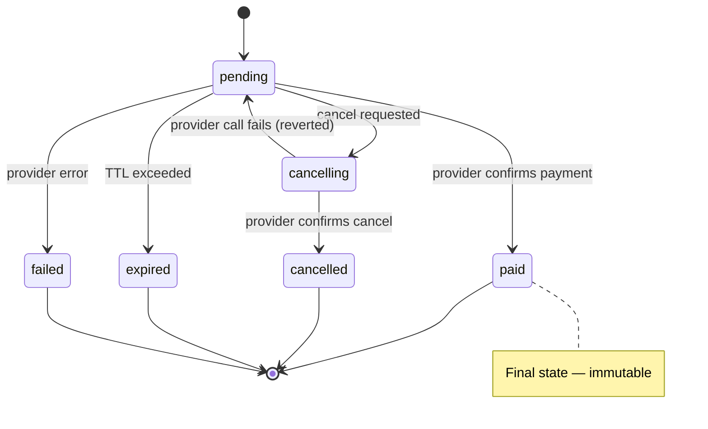
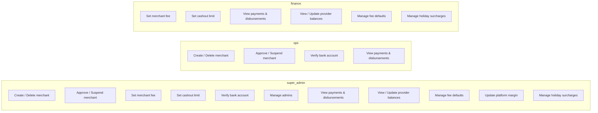
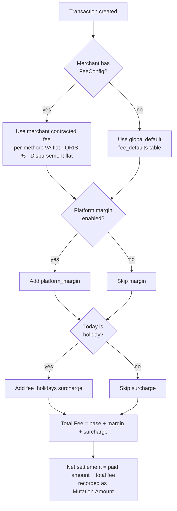
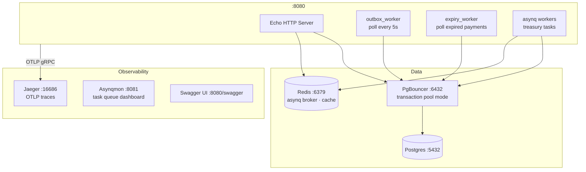
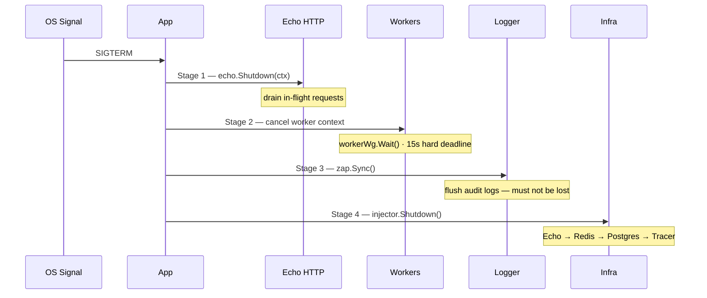

# Wanpey — Payment Gateway Aggregator

A production-ready Go modular monolith that aggregates multiple Indonesian payment providers behind a single API. Merchants integrate once; Wanpey routes to Midtrans, Xendit, DOKU, and iPaymu transparently.

---

## Table of Contents

- [Overview](#overview)
- [Architecture](#architecture)
- [Payment Flow](#payment-flow)
- [Provider Capabilities](#provider-capabilities)
- [API Reference](#api-reference)
- [Admin Permission Matrix](#admin-permission-matrix)
- [Fee Resolution](#fee-resolution)
- [Infrastructure](#infrastructure)
- [Getting Started](#getting-started)
- [Configuration](#configuration)
- [Testing](#testing)
- [Security](#security)
- [Database Migrations](#database-migrations)

---

## Overview

Wanpey operates as a **Payment Facilitator (PayFac)**:

- Holds one provider account each at Midtrans, Xendit, DOKU, and iPaymu
- All merchant cash-in flows into Wanpey's provider accounts
- Merchant balances tracked in an internal ledger (`mutations` table), not at provider level
- Cash-out is disbursed from Wanpey's provider balance to merchant's verified bank account
- Switching or adding providers is invisible to merchants

---

## Architecture

Wanpey follows Clean Architecture. Dependencies flow inward — outer layers depend on inner layers, never the reverse.



**Key design decisions:**

| Concern | Solution |
|---|---|
| Dependency injection | `samber/do v2` — lazy singletons, lifecycle via `Shutdownable` |
| DB access | `sqlc`-generated queries + `database.RunInTx` for multi-step ops |
| Async jobs | `asynq` over Redis — task queue for treasury operations |
| Distributed tracing | OpenTelemetry → Jaeger |
| Structured logging | `zap` with PII masking via `pkg/mask` |
| Configuration | TOML file (`CONFIG_PATH`) + secret env vars override |

---

## Payment Flow

### Cash-In (VA / QRIS)



### Cash-Out (Disbursement)



### Outbox Pattern — Reliable Webhook Delivery



### Payment Status Lifecycle



---

## Provider Capabilities

| Provider | Virtual Account | QRIS | Disbursement |
|---|:---:|:---:|:---:|
| Midtrans | ✅ | ✅ | ❌ |
| Xendit | ✅ | ✅ | ✅ |
| DOKU | ✅ | ✅ | ✅ |
| iPaymu | ✅ | ✅ | ❌ |

**Supported banks for VA:** BCA · BNI · BRI · BSI · Mandiri · Permata · CIMB

---

## API Reference

Interactive docs available at `http://localhost:8080/swagger/index.html` when the server is running.

### Merchant API (requires `X-API-Key` header)

| Method | Path | Description |
|---|---|---|
| `GET` | `/health` | Health check — DB, cache, outbox backlog |
| `POST` | `/v1/payments/va` | Create Virtual Account payment |
| `POST` | `/v1/payments/qris` | Create QRIS payment |
| `GET` | `/v1/payments` | List own payments |
| `GET` | `/v1/payments/:id` | Get payment detail |
| `DELETE` | `/v1/payments/:id` | Cancel payment |
| `POST` | `/v1/disbursements` | Disburse funds to bank account |
| `GET` | `/v1/disbursements` | List disbursements |
| `GET` | `/v1/disbursements/:id` | Get disbursement detail |
| `GET` | `/v1/mutations` | Ledger history |
| `GET` | `/v1/mutations/balance` | Current balance |
| `GET` | `/v1/mutations/:id` | Get mutation detail |
| `GET` | `/v1/merchants/me` | Own merchant profile |
| `PATCH` | `/v1/merchants/me` | Update profile |
| `POST` | `/v1/merchants/me/api-key/regenerate` | Rotate API key |
| `GET` | `/v1/merchants/me/bank-accounts` | List bank accounts |
| `POST` | `/v1/merchants/me/bank-accounts` | Add bank account |
| `DELETE` | `/v1/merchants/me/bank-accounts/:id` | Remove bank account |
| `PATCH` | `/v1/merchants/me/bank-accounts/:id/primary` | Set primary account |
| `GET` | `/v1/merchants/me/webhook-events` | Webhook delivery history |

### Webhooks (no auth — signed by provider)

| Method | Path | Description |
|---|---|---|
| `POST` | `/webhooks/:provider/payment` | Receive payment callback |
| `POST` | `/webhooks/:provider/disbursement` | Receive disbursement callback |

### Admin API (requires `Authorization: Bearer <token>`)

| Method | Path | Role |
|---|---|---|
| `POST` | `/admin/login` | Public |
| `POST` | `/admin/token/refresh` | Public |
| `GET` | `/admin/me` | All |
| `PATCH` | `/admin/me/password` | All |
| `POST` | `/admin/merchants` | super\_admin, ops |
| `GET` | `/admin/merchants` | All |
| `PATCH` | `/admin/merchants/:id/approve` | super\_admin, ops |
| `PATCH` | `/admin/merchants/:id/suspend` | super\_admin, ops |
| `PATCH` | `/admin/merchants/:id/fee` | super\_admin, finance |
| `PATCH` | `/admin/merchants/:id/cashout-limit` | super\_admin, finance |
| `PATCH` | `/admin/merchants/:id/bank-accounts/:aid/verify` | super\_admin, ops |
| `GET` | `/admin/payments` | All |
| `GET` | `/admin/disbursements` | All |
| `GET` | `/admin/mutations` | super\_admin, finance |
| `GET/PATCH` | `/admin/provider-balances` | super\_admin, finance |
| `GET/PUT` | `/admin/fees/default` | super\_admin, finance |
| `GET/PUT` | `/admin/fees/margin` | super\_admin (update), finance (read) |
| `GET/POST/PUT` | `/admin/fees/holidays` | super\_admin, finance |
| `POST/GET` | `/admin/admins` | super\_admin |

---

## Admin Permission Matrix



---

## Fee Resolution

All fee calculations go through `FeeResolver` — never computed ad-hoc.



Every fee change requires an admin `reason` field → written to `fee_audit_logs` (immutable, append-only).

---

## Infrastructure



### Graceful Shutdown (4-stage)



---

## Getting Started

### Prerequisites

- Go 1.25+
- Docker + Docker Compose
- Make

### First-time setup

```bash
# 1. Install dev tools
make install-tools
make install-hooks

# 2. Copy and fill in credentials
cp .config.example.toml .config.toml
# edit .config.toml with your provider sandbox keys

# 3. Start infrastructure
make infra-up

# 4. Run database migrations
make migrate-up

# 5. Create first admin account
make seed-admin EMAIL=admin@example.com PASSWORD=secret ROLE=super_admin

# 6. (Optional) Seed sample dev data
make seed-dev

# 7. Start the server with hot reload
make dev
```

Server runs at `http://localhost:8080`.

### Daily development commands

```bash
make dev              # hot reload via Air
make test             # unit tests (no network)
make test-integration # integration tests (requires .config.toml with real creds)
make test-e2e         # end-to-end tests (requires infra-up)
make lint             # golangci-lint
make migrate-up       # apply pending migrations
make sqlc             # regenerate DB code after editing query/*.sql
```

### Seed a test merchant

```bash
make seed-merchant EMAIL=merchant@example.com NAME="Test Store" WEBHOOK_URL=http://localhost:9090/hook
# prints the API key once — save it
```

---

## Configuration

Copy `.config.example.toml` → `.config.toml`. Override path with `CONFIG_PATH` env var.

> **Important:** `migrate_dsn` must point directly to Postgres (`:5432`), not PgBouncer. golang-migrate uses advisory locks which PgBouncer transaction mode does not support.

### Secret env vars (override config file values)

| Env var | Purpose |
|---|---|
| `CONFIG_PATH` | Path to TOML config file |
| `DOKU_PRIVATE_KEY_PEM` | DOKU RSA private key PEM — use this in production instead of config file |

### API key format

| Mode | Format |
|---|---|
| Sandbox | `wpay_test_<32 random chars>` |
| Production | `wpay_live_<32 random chars>` |

Raw key shown **once** at creation/regeneration. Stored as SHA256 hash in DB.

---

## Testing

```bash
# Unit tests — fast, no network, no credentials
make test

# Integration tests — hit real provider sandboxes
# Requires .config.toml with valid sandbox credentials
make test-integration

# End-to-end tests — full stack against local infra
# Requires: make infra-up + make migrate-up + .config.toml
make test-e2e

# Single package / single test function
go test -race -run TestFunctionName ./internal/path/to/package/...
```

Integration and E2E tests call `t.Skip()` when credentials are empty — safe to commit without credentials.

---

## Security

### Authentication

- **Merchant API**: `X-API-Key` header → SHA256 hash lookup → constant-time comparison
- **Admin API**: short-lived JWT access token + refresh token

### Webhook security

- **Inbound (provider → Wanpey)**: signature verified per-provider (HMAC or static token)
- **Outbound (Wanpey → merchant)**: signed with merchant's `webhook_signing_key` via HMAC-SHA256 (`X-Wanpey-Signature` header)
- **IP allowlist**: optional per-provider CIDR allowlist for `/webhooks/*` routes

### Finance-grade patterns

| Pattern | Detail |
|---|---|
| Idempotency | `SetNX` atomic claim, 24h TTL, key `idempotency:{merchant_id}:{key}` |
| Outbox | Payment update + outbox insert in same DB transaction — no lost webhooks |
| Disbursement reservation | Pending row inserted inside balance-check transaction — prevents double-spend |
| Two-step cancel | `pending → cancelling → cancelled` — prevents double-cancel races |
| Circuit breaker | Wraps every provider network call (`gobreaker`) |
| Bank account limit | `SELECT COUNT(*) FOR UPDATE` inside transaction — prevents concurrent bypass of 3-account max |
| PII masking | `pkg/mask` wraps all sensitive fields before passing to logger |

### Rate limiting

Rate limiting is handled at the infrastructure layer (Nginx, Traefik, or cloud load balancer) — **not** in the app. Webhook routes (`/webhooks/*`) must never be rate limited.

---

## Database Migrations

Migrations live in `migrations/` — `golang-migrate` format (`NNNNNN_name.up.sql` / `.down.sql`).

```bash
make migrate-up      # apply all pending
make migrate-down    # rollback last
make migrate-status  # show current version
```

Run from project root — the `file://migrations` source path is CWD-relative.
